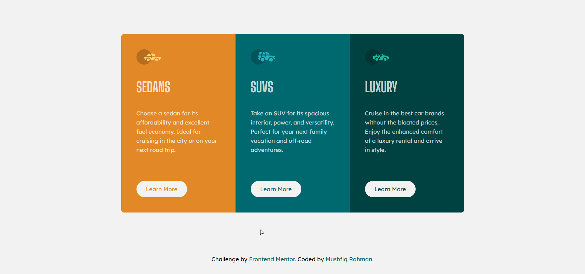

# Frontend Mentor - 3-column preview card component solution

This is a solution to the [3-column preview card component challenge on Frontend Mentor](https://www.frontendmentor.io/challenges/3column-preview-card-component-pH92eAR2-).

## Table of contents

- [Screenshot](#screenshot)
- [Links](#links)
- [Built with](#built-with)
- [Author](#author)

## Screenshot

## Links

- [Solution](https://www.frontendmentor.io/solutions/responsive-3column-card-component-using-semantic-html-and-css-JreuNIVgy)
- [Live site](https://fm-challenge-3-column-preview-card-component.netlify.app/)

## Built with

- HTML
- CSS
- Mobile-first workflow

## Author

- Website - [Mushfiq Rahman](https://mushfiq-rahman.netlify.app)
- Frontend Mentor - [@Ayon95](https://www.frontendmentor.io/profile/Ayon95)
