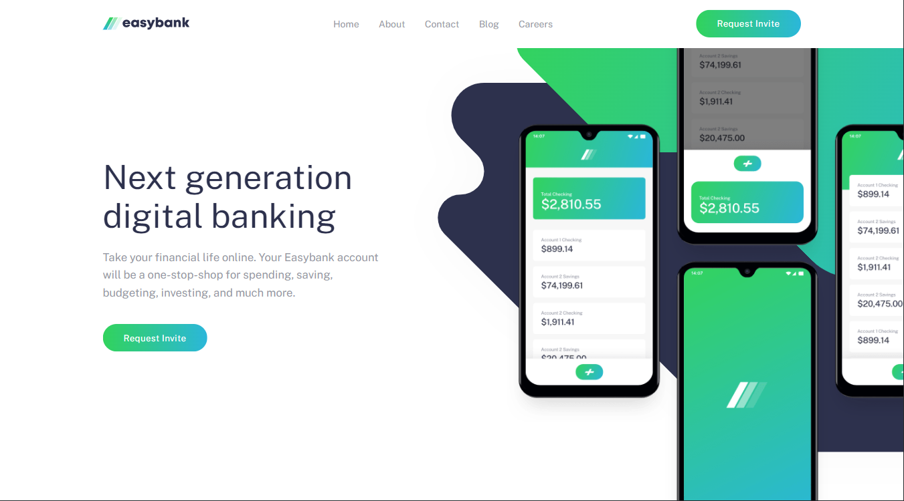
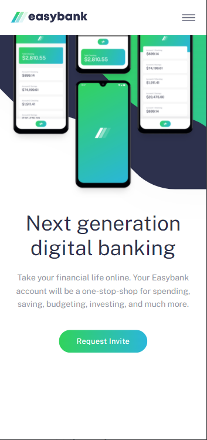

# Frontend Mentor - Easybank landing page solution

This is a solution to the [Easybank landing page challenge on Frontend Mentor](https://www.frontendmentor.io/challenges/easybank-landing-page-WaUhkoDN).

## Table of contents

- [Screenshot](#screenshot)
- [Links](#links)
- [Built with](#built-with)
- [Author](#author)

## Screenshot

## Links

- [Solution](https://www.frontendmentor.io/solutions/responsive-easybank-landing-page-using-semantic-html-and-scss-U9tLtsd27)
- [Live site](https://fm-challenge-easybank-landing-page.netlify.app/)

## Built with

- HTML
- Sass (SCSS)
- JavaScript
- Mobile-first workflow

## Author

- Website - [Mushfiq Rahman](https://mushfiq-rahman.netlify.app)
- Frontend Mentor - [@Ayon95](https://www.frontendmentor.io/profile/Ayon95)
