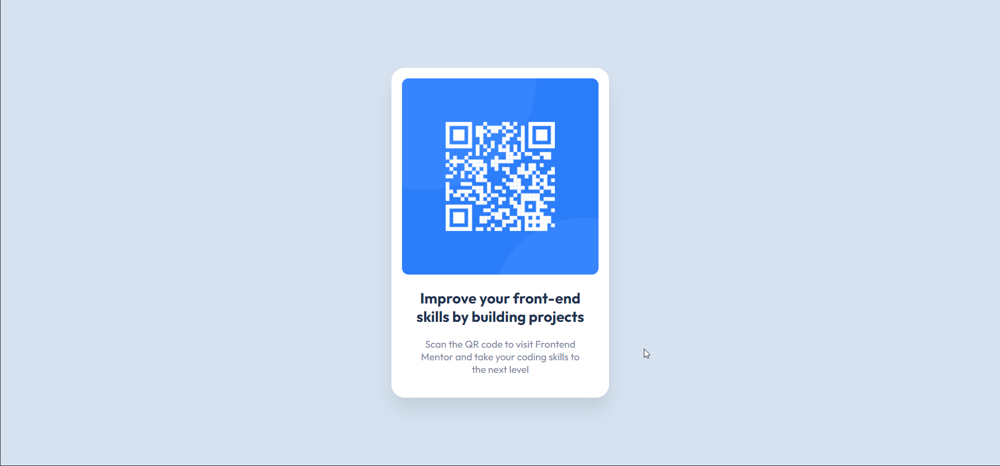

# Frontend Mentor - QR code component solution

This is a solution to the [QR code component challenge on Frontend Mentor](https://www.frontendmentor.io/challenges/qr-code-component-iux_sIO_H).

## Table of contents

- [Screenshot](#screenshot)
- [Links](#links)
- [Built with](#built-with)
- [Author](#author)

## Screenshot

## Links

- [Solution](https://www.frontendmentor.io/solutions/qr-code-component-using-semantic-html-and-css-OcHwfG3iS)
- [Live site](https://fm-qr-code-challenge.netlify.app/)

## Built with

- HTML
- CSS

## Author

- Website - [Mushfiq Rahman](https://mushfiq-rahman.netlify.app)
- Frontend Mentor - [@Ayon95](https://www.frontendmentor.io/profile/Ayon95)
