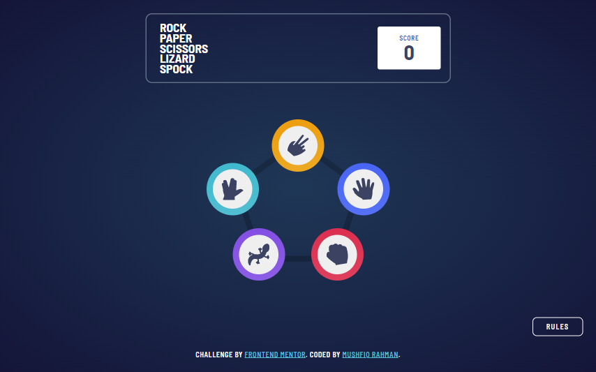
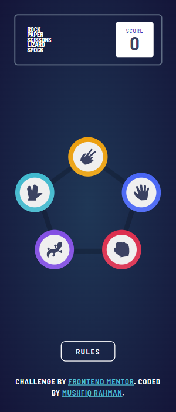

# Frontend Mentor - Rock, Paper, Scissors solution

This is a solution to the [Rock, Paper, Scissors challenge on Frontend Mentor](https://www.frontendmentor.io/challenges/rock-paper-scissors-game-pTgwgvgH).

## Table of contents

- [Screenshot](#screenshot)
- [Links](#links)
- [Built with](#built-with)
- [Author](#author)

## Screenshot

## Links

- [Solution](https://www.frontendmentor.io/solutions/responsive-rock-paper-scissors-lizard-spock-with-html-css-and-js-Hy0MTPw4q)
- [Live site](https://fm-challenge-rock-paper-scissors-lizard-spock.netlify.app/)

## Built with

- HTML
- CSS
- JavaScript
- Mobile-first workflow

## Author

- Website - [Mushfiq Rahman](https://mushfiq-rahman.netlify.app)
- Frontend Mentor - [@Ayon95](https://www.frontendmentor.io/profile/Ayon95)
